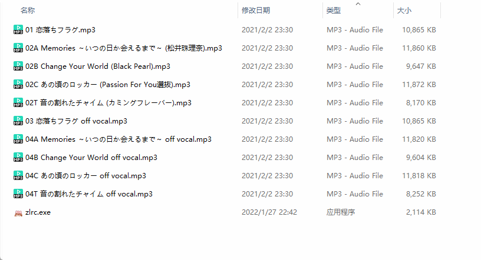
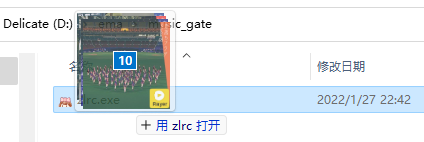
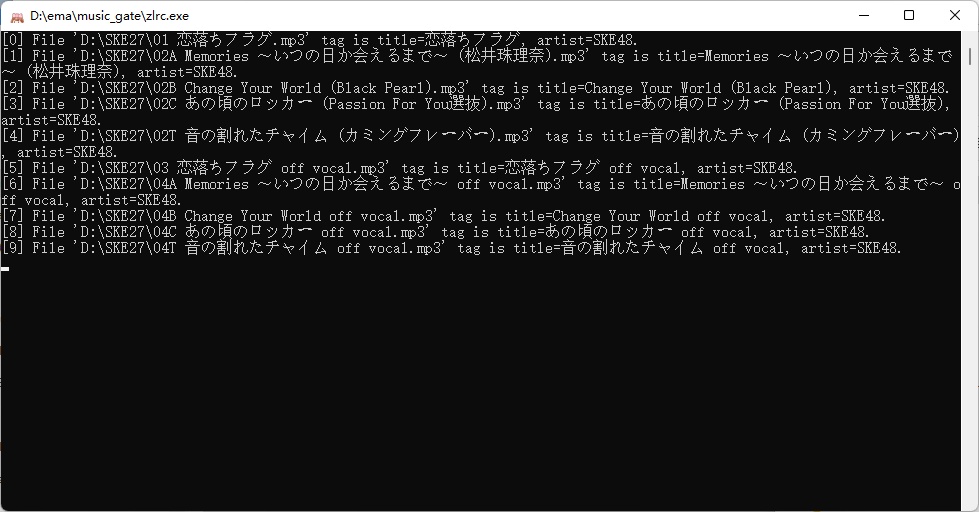

#  zlrc

Lylic CLI downloader base on [ZonyLrcTools](https://github.com/jjzhang166/ZonyLrcTools). Refer to some of the core source code of the project.

Only Windows OS (≥win7) supported.

## ScreenShot

## 

Drag and drop the song file to `zlrc.exe`, which supports multiple files.

## Download

Get software [here](https://github.com/emako/zlrc/releases).

## License

zlrc is licensed under the [MIT](https://github.com/emako/zlrc/blob/main/LICENSE) License.

