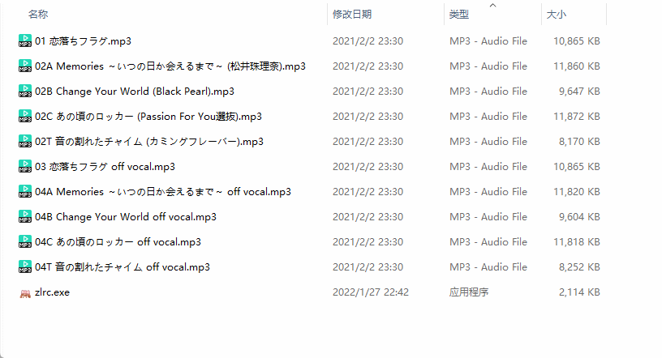
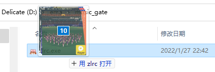
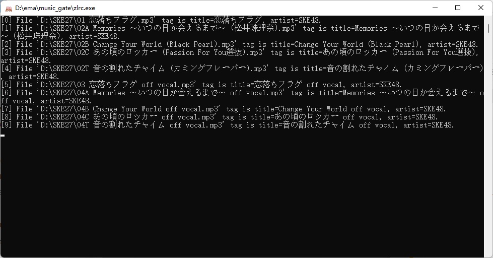

#  zlrc
zlrc是一款基于[ZonyLrcTools](https://github.com/jjzhang166/ZonyLrcTools)的歌词下载工具，参考了该项目的部分核心源码。

仅支持Windows系统（≥win7）。

Lylic CLI downloader base on [ZonyLrcTools](https://github.com/jjzhang166/ZonyLrcTools). Refer to some of the core source code of the project.

Only Windows OS (≥win7) supported.

## 截图 Screen-shot

## 

拖放歌曲文件到`zlrc.exe`即可，支持多文件。

Drag and drop the song file to `zlrc.exe`, which supports multiple files.

## 下载 Download

通过[这里](https://github.com/emako/zlrc/releases)可以获取工具。

Get software [here](https://github.com/emako/zlrc/releases).

## 许可证 License

zlrc基于 [MIT](https://github.com/emako/zlrc/blob/main/LICENSE) 许可证。

zlrc is licensed under the [MIT](https://github.com/emako/zlrc/blob/main/LICENSE) License.

